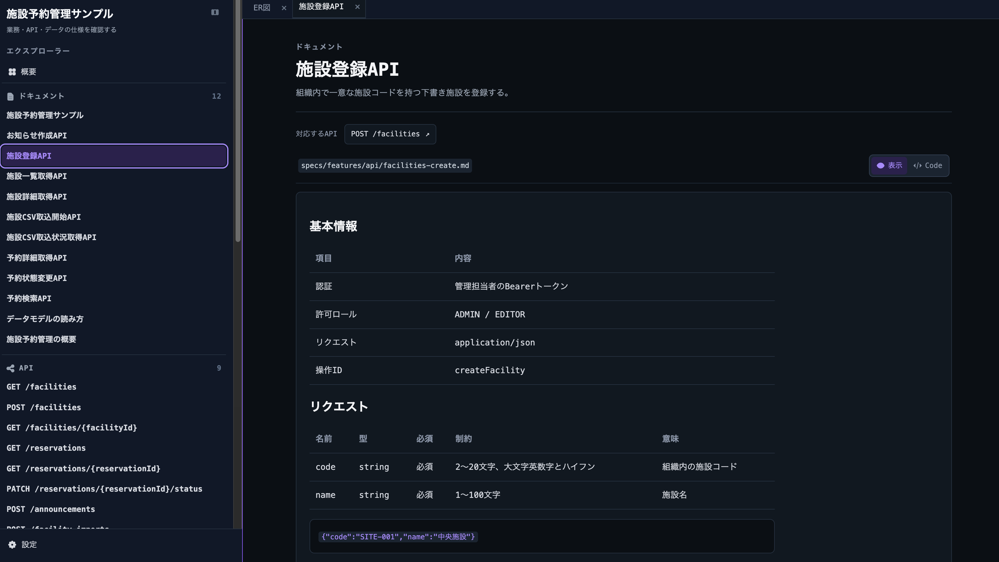
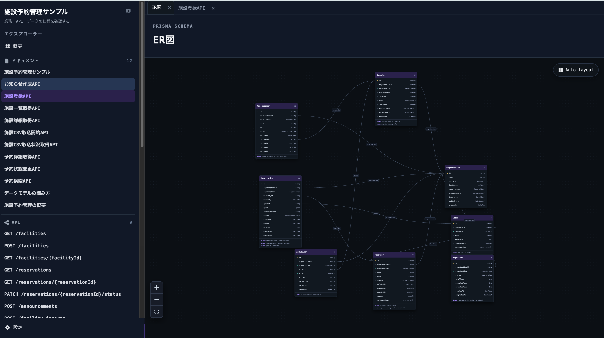
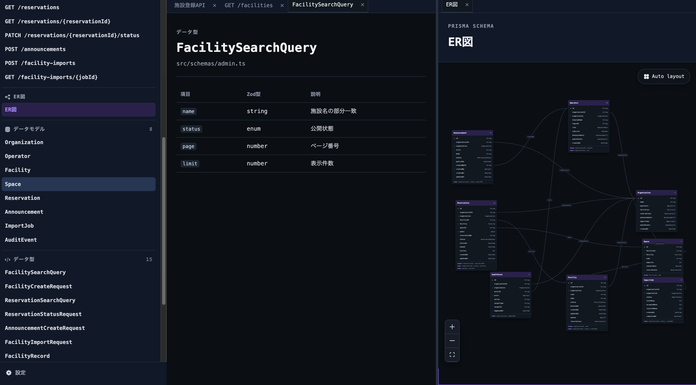
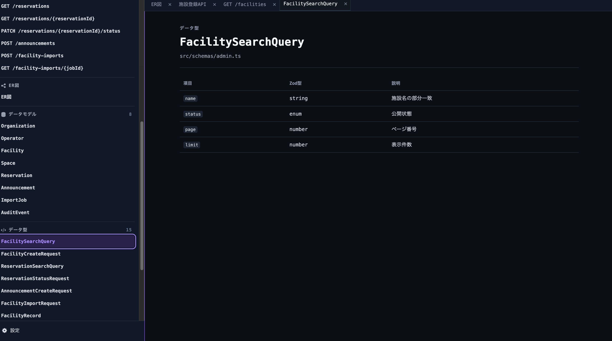
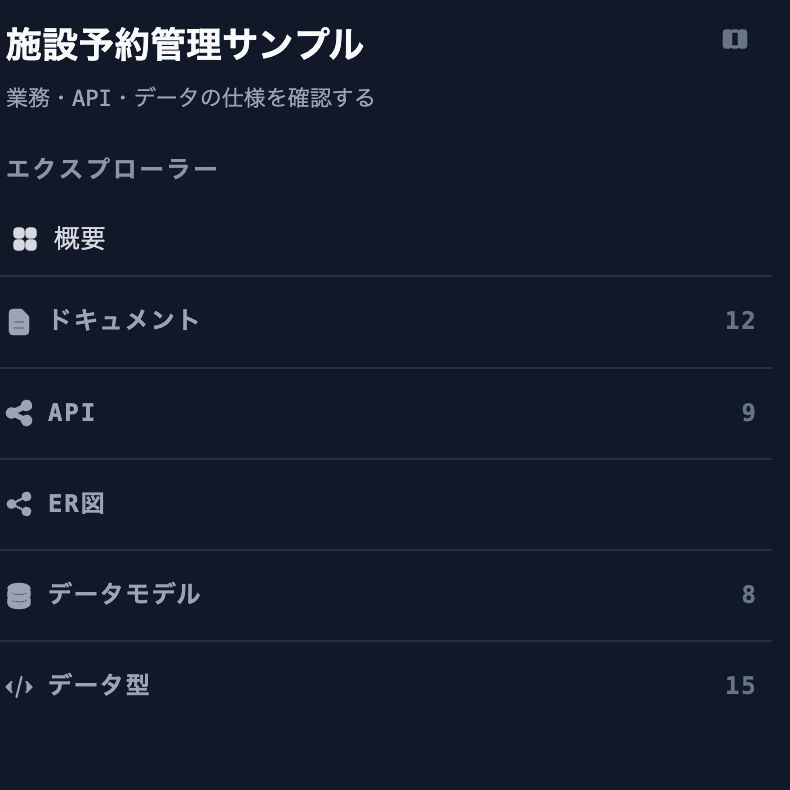
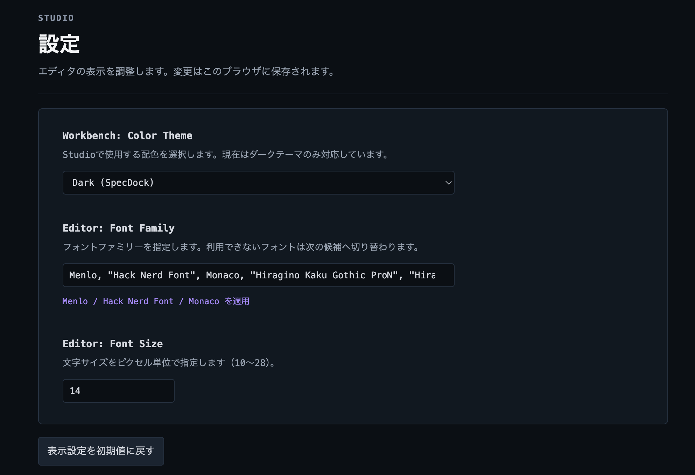
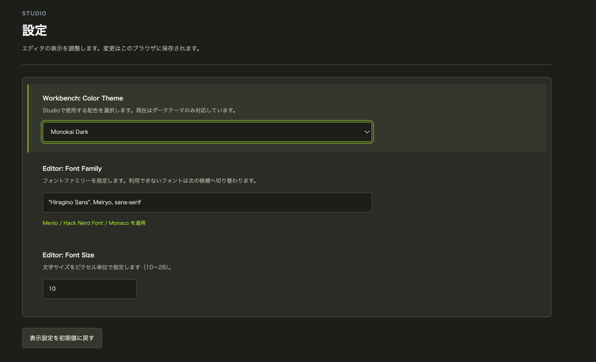

# SpecDock

**Source-anchored specifications.
** Prisma Schema、OpenAPI、Zod、Markdownに分かれた仕様を、ひとつのStudioでたどるためのツールです。独自の仕様言語へ書き換えず、既存プロジェクトのソースをそのまま参照します。

APIの入出力からデータ型・データモデル・業務ドキュメントを参照できます。
仕様を書く人は、ソース間の不整合をCLIで確認できます。SpecDockは開発中のOSSです。

## できること

| 参照するソース | Studioで確認できる内容 |
| --- | --- |
| Markdown | API別の設計書、業務ルール、Mermaid図 |
| OpenAPI | 操作、認証、パラメータ、リクエスト、レスポンス、制約 |
| Prisma Schema | 論理データモデル、フィールド、リレーション、ER図 |
| Zod | データ型と入力値の検証ルール |

サイドメニューのエクスプローラーより対象を選択し、タブや左右のペインで並べて確認できます。  
Studio設定よりダークテーマ、フォント、文字サイズを変更できます。  
既定のフォントはMenlo、Hack Nerd Font、Monacoを優先し、日本語にはヒラギノ角ゴシック、ヒラギノ、メイリオをフォールバックとして使用します。  
左右分割時は中央の区切り線をドラッグ、または選択して左右矢印キーで幅を調整できます。  
表示設定と幅はブラウザ内に保存されます。  

## Studioの画面

以下は[施設予約管理サンプル](examples/facility-admin/README.md)を表示した例です。

### API別の設計書

Markdownの設計書から、対応するAPIや入力条件を確認できます。



### ER図

Prisma Schemaのモデルとリレーションを図で確認できます。



### 左右に並べて参照

データ型とER図など、異なる仕様を別々のペインで同時に開けます。



<details>
<summary>データ型・エクスプローラー・表示設定の画面も見る</summary>

データ型の項目と説明：



エクスプローラーの構成：



フォントや文字サイズなどの表示設定：



別のダークテーマを選んだ例：



</details>

## まず試す

Node.js 20.19以上とnpmが必要です。現在はnpm公開パッケージではないため、リポジトリから起動します。

```sh
git clone https://github.com/Nenene01/spec-dock.git
cd spec-dock
npm ci
npm run studio -- --project examples/facility-admin --port 4173
```

ブラウザで <http://localhost:4173/> を開いてください。`Ctrl-C` で停止します。[施設予約管理サンプル](examples/facility-admin/README.md)は架空の管理画面仕様で、APIサーバーやデータベースへの接続は不要です。

## 自分のプロジェクトを接続する

SpecDockのリポジトリルートで、対象プロジェクトのパスを指定します。

```sh
npm run specdock -- init --project /path/to/your-project
npm run check -- --project /path/to/your-project --format json
npm run studio -- --project /path/to/your-project --port 4173
```

`init` はソース候補を探し、対話形式で `spec-dock.config.json` を作ります。Studioの表示名、APIのモード、Prisma・OpenAPIのファイル、Zod・Documentsのディレクトリを記録できます。
ただし現状の`scan`はプロジェクト内の対象ファイルを探索し、設定した`sources`のパスで解析対象を絞り込む機能はありません。
既存の設定ファイルがある場合、上書き前に確認します。設定例は[サンプルの設定ファイル](examples/facility-admin/spec-dock.config.json)を参照してください。

ビルド成果物は対象プロジェクトの `.specdock/` に保存されます。
Studioはソースを編集しません。実際の案件を読み込む場合は、生成物やスクリーンショットを公開しないよう注意してください。

## ソースの扱い

- Prisma Schemaは論理データモデルを表します。PostgreSQL固有のCHECK・RLS・Triggerなど、実データベースの全定義を検査する機能はありません。
- `contract-first` ではOpenAPIをAPIの正本、Zodを実装側の検証として扱います。`code-first` ではZodを正本にできますが、OpenAPIの生成は別のツールの役割です。**SpecDock自体はOpenAPIを生成しません。**
- Markdownは背景・振る舞い・判断を記述する場所です。Studioの表示や診断結果は、これらのソースに代わる正本ではありません。

## CLI

| コマンド | 用途 |
| --- | --- |
| `npm run specdock -- init --project <path>` | 対話形式で設定ファイルを作成 |
| `npm run scan -- --project <path>` | ソースを解析して中間モデルを出力 |
| `npm run check -- --project <path> --format json` | 診断結果を確認 |
| `npm run build -- --project <path>` | 静的なStudioを生成 |
| `npm run studio -- --project <path> --port 4173` | ビルドしてローカルで表示 |
| `npm run dev -- --project <path> --port 4173` | ソースの変更を監視して再ビルド |

CLIの全コマンドには `--project` で対象を指定できます。
`build`・`studio`・`dev` は現状、SpecDockのリポジトリルートから実行してください。
開発・検証の詳しい流れは[開発ガイド](docs/guides/development-loop.md)を参照してください。

## 開発に参加する

不具合報告、使い勝手の提案、文書・サンプルの改善を歓迎します。環境構築、変更時の確認事項、Pull Requestの手順は[CONTRIBUTING.md](CONTRIBUTING.md)にまとめています。
このリポジトリでは、Spec・Architecture・ADR・Guide・Rulesを分けて管理しています。
配置と正本の案内は[開発文書の案内](docs/README.md)、開発の共通原則は[CONSTITUTION.md](CONSTITUTION.md)を参照してください。

AIエージェントを使う開発手順は[Agent development loop](docs/guides/agent-loop.md)にあります。
