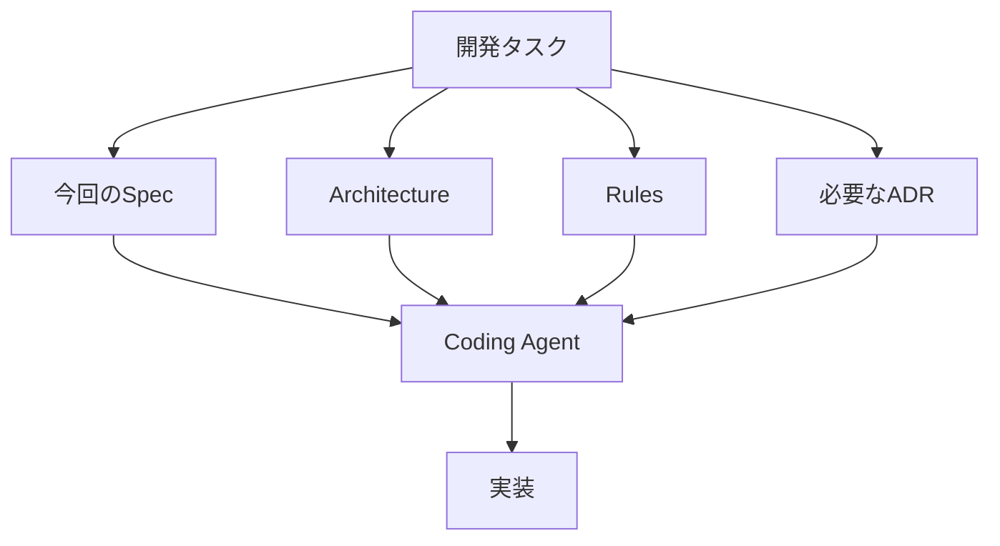

# AI context guide

AI駆動開発では、すべての知識を巨大な仕様書へまとめず、タスクに必要な役割の文書だけをコンテキストへ渡す。

## 参照順

1. `specs/`から今回の受け入れ条件を選ぶ
2. `docs/architecture/`から関係する構成境界を選ぶ
3. `rules/`から常時適用するルールを選ぶ
4. `docs/adr/`から関連する設計判断だけを選ぶ
5. 実装後、Specの受け入れ条件とテストで検証する

モデルやエージェントごとにプロンプト形式が変わっても、文書の責務分離は維持する。
