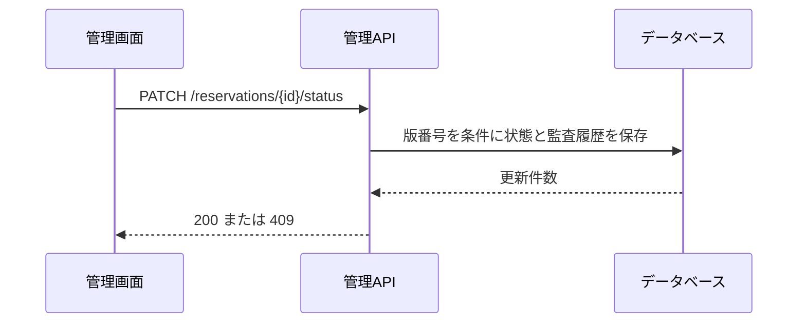

# 予約状態変更API

表示時の版番号で競合を確認し、予約状態と監査履歴を更新する。

## 基本情報

| 項目 | 内容 |
| :--- | :--- |
| 認証 | 管理担当者のBearerトークン |
| 許可ロール | ADMIN / EDITOR |
| リクエスト | application/json |
| 操作ID | changeReservationStatus |

## リクエスト

| 名前 | 場所 | 必須 | 制約・意味 |
| :--- | :--- | :--- | :--- |
| reservationId | path | 必須 | UUID |
| status | body | 必須 | CONFIRMED または CANCELLED |
| expectedVersion | body | 必須 | 1以上の整数、詳細取得時の版番号 |
| reason | body | 任意 | 最大240文字。取消時は必須 |

```json
{"status":"CONFIRMED","expectedVersion":1}
```

## 状態遷移

| 現在 | 変更後 | 許可 | 条件 |
| :--- | :--- | :--- | :--- |
| REQUESTED | CONFIRMED | 可 | 開始前の予約 |
| REQUESTED | CANCELLED | 可 | 理由を入力 |
| CONFIRMED | CANCELLED | 可 | 理由を入力、開始前 |
| CANCELLED | CONFIRMED | 不可 | 再開は別予約として扱う |

## レスポンス

200で更新後の予約を返す。`version` は1増える。

## 処理・検証

1. 認証・権限・組織境界と入力形式を確認する。
2. 予約状態、利用開始日時、`expectedVersion` を確認する。
3. 予約更新と監査履歴登録を同一トランザクションで実行する。対象行の更新件数が0なら409を返す。
4. 同じ版番号で再送した場合も二重更新しない。



## エラー

| HTTP | 条件 |
| :--- | :--- |
| 400 | 値・取消理由・状態遷移が不正 |
| 403 | 編集権限がない |
| 404 | 対象がない、または組織境界の外にある |
| 409 | 版番号の競合、または既に変更済み |

定義元: [OpenAPI](../../../openapi.yaml) / [Prisma Schema](../../../prisma/schema.prisma)。
