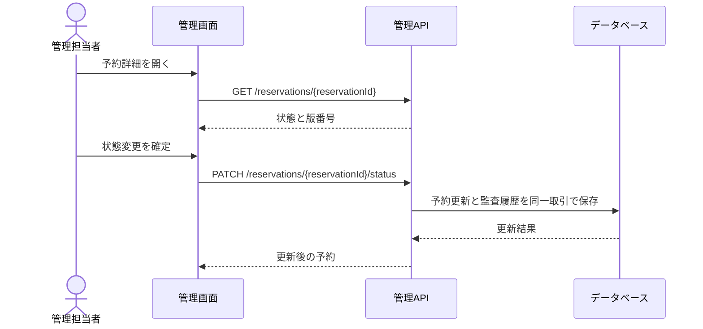

# 施設予約管理の概要

架空の複数組織向け施設予約サービスを運営する管理画面。

## 管理画面でできること

- 施設を検索し、下書きとして登録する。
- 予約を条件付きで検索し、詳細と状態を確認する。
- 権限のある担当者が予約の状態を変更し、監査履歴を残す。
- お知らせを下書きまたは公開予約として登録する。
- 施設CSVの検証・取込を非同期ジョブとして開始し、結果を確認する。

## 利用者と権限

| ロール | 閲覧 | 施設登録・お知らせ作成 | 予約の状態変更 | CSV取込 |
| :--- | :--- | :--- | :--- | :--- |
| ADMIN | 可 | 可 | 可 | 可 |
| EDITOR | 可 | 可 | 可 | 不可 |
| VIEWER | 可 | 不可 | 不可 | 不可 |

認証済みトークンから組織IDとロールを得る。リクエストで任意の組織IDを指定して対象を切り替えることはできない。他組織のIDを指定した場合は、対象が存在しないものとして扱う。

## 仕様のたどり方

1. この文書で業務範囲と権限を確認する。
2. 各API設計書で操作・検証・エラー・更新条件を確認する。
3. [OpenAPI](../../openapi.yaml)でHTTP契約と項目制約を確認する。
4. [Prisma Schema](../../prisma/schema.prisma)と[データモデルの読み方](data-model.md)で保持する情報と関連を確認する。

## 予約変更の流れ

## サンプルの境界

この一式は架空の設計サンプルであり、実装済みサービスを表しません。CSVファイルの受付処理、JWTの発行、DBのRLSポリシーは対象外です。実案件の文面や値を再現していません。
