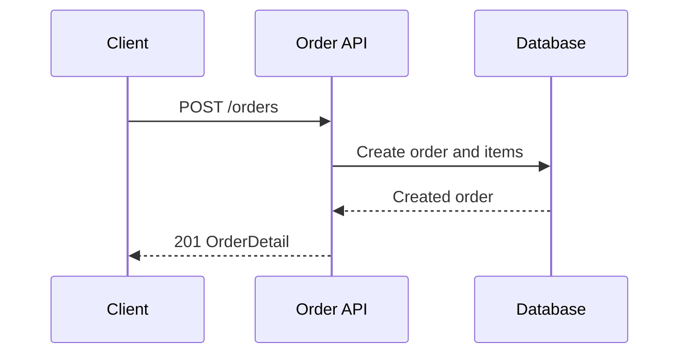

# 注文作成API

顧客と商品明細を指定して注文を作成する。

**API**: `POST /orders`

## Acceptance criteria

- 顧客IDは必須
- 明細は1件以上20件以下
- 数量は1以上99以下

## Processing flow

## Related sources

- [OpenAPI contract](../../../openapi.yaml)
